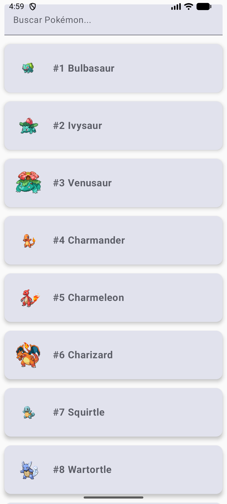
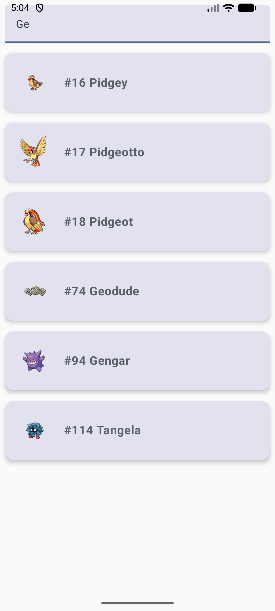
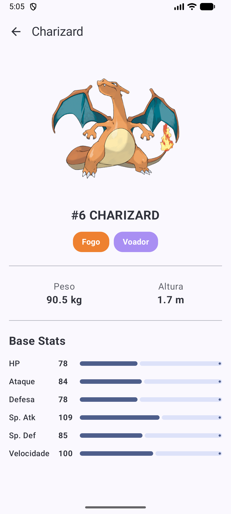

# Pokedex App (Teste Android)

Este projeto é uma solução para o teste de desenvolvedor Android, que consiste em criar um aplicativo para navegar pela Pokédex utilizando a [PokéApi](https://pokeapi.co/).

O aplicativo permite ao usuário visualizar uma lista de 150 Pokémon, filtrá-los por nome e clicar em cada um para ver detalhes.

## 📸 Screenshots (Capturas de Tela)

| Lista de Pokémon | Busca (Filtro) | Tela de Detalhes |
| :---: | :---: | :---: |
|  |  |  |

## ✨ Funcionalidades Implementadas

O app cumpre todos os requisitos principais da task, além de diversos itens bônus.

### Requisitos Principais
* **Lista de 150 Pokémon**: Exibição da lista com nome e ID.
* **Tela de Detalhes**: Ao clicar em um item, o usuário vê mais informações (imagem em alta qualidade, tipos, peso, altura e stats base).

### Arquitetura e Especificações
* **100% Kotlin**
* **Arquitetura MVVM**: Utilizando `ViewModel`, `Repository` e `StateFlow` para uma UI reativa.
* **Injeção de Dependência**: Configurada com **Hilt** para gerenciar as dependências e facilitar os testes.
* **Clean Code**: Código separado por responsabilidades (UI, ViewModel, Repositório, API, Utils).
* **Navegação**: Utiliza **Jetpack Navigation for Compose** para navegar entre as telas.
* **UI Moderna**: Interface construída inteiramente com **Jetpack Compose**.
* **Networking**: **Retrofit** para consumo da API e **Coil** para carregamento de imagens.

### ✅ Itens Bônus Concluídos
* **Paginação**: A lista principal é carregada de forma paginada usando a biblioteca **Paging 3**.
* **Filtragem por Nome**: Uma barra de busca permite filtrar a lista de 150 Pokémon localmente.
* **Tratamento de Erros**: O app exibe mensagens claras para erros de rede, Pokémon não encontrado na busca e falhas ao carregar detalhes.
* **Testes Unitários**:
    * Testes de lógica pura (Utils) para garantir a formatação correta dos dados.
    * Testes de ViewModel (com Mocks e `TestDispatcher`) para validar a lógica de estados (Loading, Success, Error).
* **Cache Offline (Response Caching)**:
    * O app utiliza um `OkHttpClient` customizado com cache em disco.
    * Após o primeiro uso, a lista principal e os detalhes dos Pokémon visitados **funcionam 100% offline**, carregando instantaneamente do cache.
* **Layouts Agradáveis**: A tela de detalhes foi estilizada para ser informativa e visualmente atraente, com tradução dos tipos de Pokémon e barras de stats.